# SCColorSampler

[](https://developer.apple.com/documentation/screencapturekit/)
 

 
[](https://swift.org/package-manager)

A Swift 5.4, highly-customizable, ScreenCaptureKit-based color sampler.

## Overview

Adapted from [https://github.com/dagronf/DSFColorSampler](https://github.com/dagronf/DSFColorSampler) for ScreenCaptureKit and with some minor improvements and more customization.

`Requires screen sharing permission!`

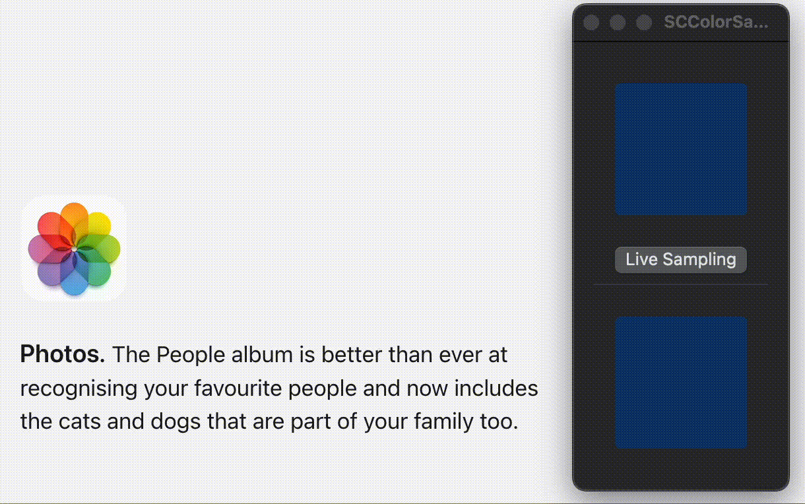

## Why?
While Apple does offer `NSColorSampler()` as a native solution, it is not customizable and so it might not fit everyone's needs.

Also with the release of macOS 14.0 (Sonoma), Apple deprecated `CGWindowListCreateImage` which was previously used for multiple custom color sampler packages.

## Features

* Highly customizable to fit every project's needs
* Simple block callbacks
* Hit Escape to cancel picking
* Use the mouse scroll wheel | pinch gesture to zoom in and zoom out

## Usage

### Swift Package Manager

Add `https://github.com/danielcapra/SCColorSampler` to your project.

## API

```swift
let configuration = SCColorSamplerConfiguration()

SCColorSampler.sample(configuration: configuration) { hoveredColor in
    // Do something with the hoveredColor
    // ...
} selectionHandler: { selectedColor in 
    // Check if user cancelled
    guard let selectedColor = selectedColor else {
        return
    }
    // Do something with the selectedColor
    // ...
}
```

### Configuration customization examples

#### Loupe shape
<p float="left">
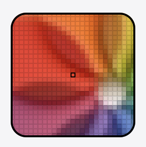
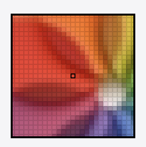
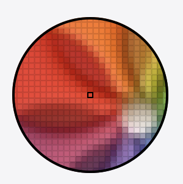
</p>

```swift
let configuration = SCColorSamplerConfiguration()

configuration.loupeShape = .roundedRect // default
// or
configuration.loupeShape = .circle
// or
configuration.loupeShape = .rect

SCColorSampler.sample(configuration: configuration) { ... }
```

#### Loupe size
<p float="left">
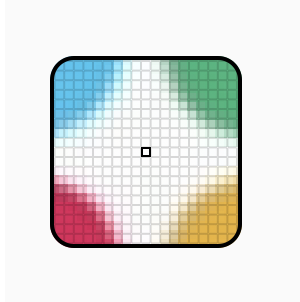
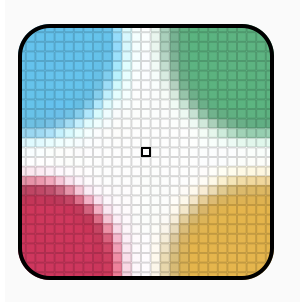
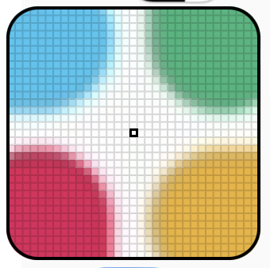
</p>

```swift
let configuration = SCColorSamplerConfiguration()

configuration.loupeSize = .small
// or
configuration.loupeSize = .medium // default
// or
configuration.loupeSize = .large
// or
configuration.loupeSize = .custom(256) // custom CGFloat value

SCColorSampler.sample(configuration: configuration) { ... }
```

#### Quality
<p float="left">
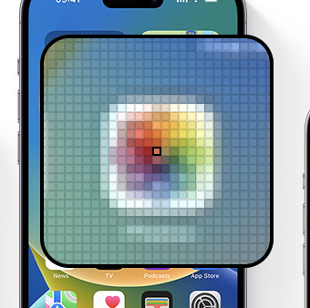
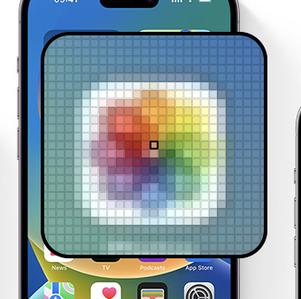

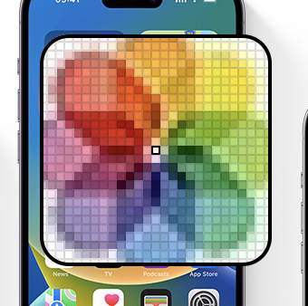
</p>

```swift
let configuration = SCColorSamplerConfiguration()

configuration.quality = .low
// or
configuration.quality = .nominal
// or
configuration.quality = .good // default
// or
configuration.quality = .great

SCColorSampler.sample(configuration: configuration) { ... }
```

#### Zoom starting value
This will be the starting zoom value each time the color sampler function is called and the loupe appears.

<p float="left">
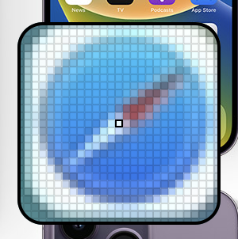
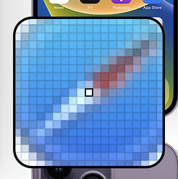
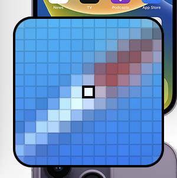
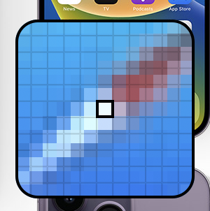
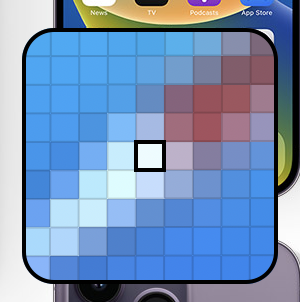
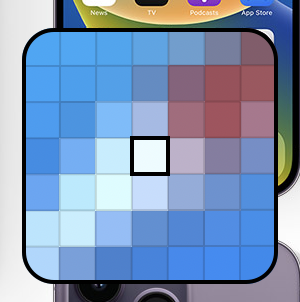
</p>

```swift
let configuration = SCColorSamplerConfiguration()

configuration.defaultZoomValue = .xs
// or
configuration.defaultZoomValue = .s
// or
configuration.defaultZoomValue = .m // default
// or
configuration.defaultZoomValue = .l
// or
configuration.defaultZoomValue = .xl
// or
configuration.defaultZoomValue = .xxl

SCColorSampler.sample(configuration: configuration) { ... }
```

#### Zoom available values
These will be the zoom values the user is allowed to scrub through.

Note: If the `defaultZoomValue` is not included in the `zoomValues` array, it will automatically be added to it.
```swift
// For example:
configuration.defaultZoomValue = .xs
configuration.zoomValues = [.s, .m]
// The zoom values the user will be allowed to scrub through will be [.xs, .s, .m]
```

<p float="left">
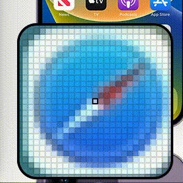
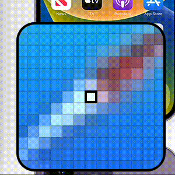
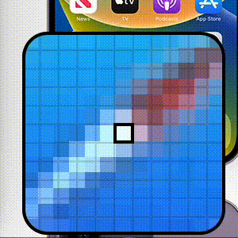
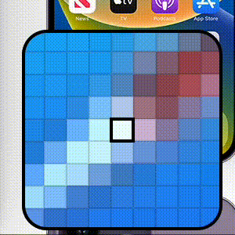
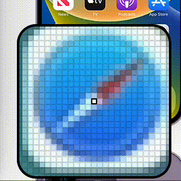
</p>

```swift
let configuration = SCColorSamplerConfiguration()

configuration.defaultZoomValue = .xs
configuration.zoomValues = [] // Zoom functionality disabled
// or
configuration.zoomValues = [.xs] // If the only element in the array matches the defaultZoomValue that also results in the zoom functionality being disabled
// or
configuration.zoomValues = [.xs, .s]
// or
configuration.zoomValues = [.xs, .s, .m]
// or
configuration.zoomValues = [.xs, .s, .m, .l]
// or
configuration.zoomValues = [.xs, .s, .m, .l, .xl]
// or
configuration.zoomValues = [.xs, .s, .m, .l, .xl, .xxl] // Default

SCColorSampler.sample(configuration: configuration) { ... }
```

#### Show Color Description
<p float="left">
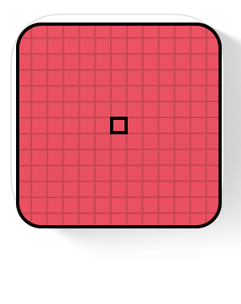
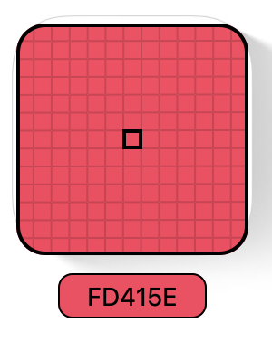
</p>

```swift
let configuration = SCColorSamplerConfiguration()

configuration.showColorDescription = false
// or
configuration.showColorDescription = true // default

SCColorSampler.sample(configuration: configuration) { ... }
```

#### Color Description Method
Customize the color description shown under the color loupe with your own method that takes in a NSColor and returns a string.

<p float="left">
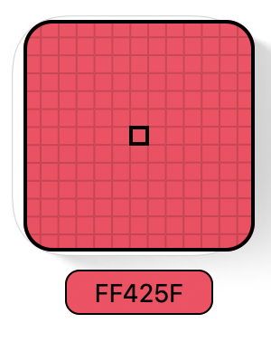
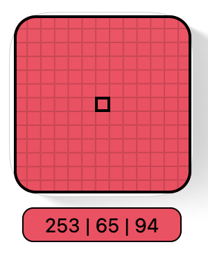
</p>

```swift
let configuration = SCColorSamplerConfiguration()

// Any closure of type (NSColor) -> String
configuration.colorDescriptionMethod = { hoveredColor in
    // Returns hex string (default)
    let red = Int((hoveredColor.redComponent * 255).rounded())
    let green = Int((hoveredColor.greenComponent * 255).rounded())
    let blue = Int((hoveredColor.blueComponent * 255).rounded())
    
    return String(
        format: "%02x%02x%02x",
        red,
        green,
        blue
    ).uppercased()
}
// or
configuration.colorDescriptionMethod = { hoveredColor in
    // Returns rgb values
    let red = Int((hoveredColor.redComponent * 255).rounded())
    let green = Int((hoveredColor.greenComponent * 255).rounded())
    let blue = Int((hoveredColor.blueComponent * 255).rounded())
    
    return "\(red) | \(green) | \(blue)"
}

SCColorSampler.sample(configuration: configuration) { ... }
```

# License

```
MIT License

Copyright (c) 2023 Daniel Capra

Permission is hereby granted, free of charge, to any person obtaining a copy
of this software and associated documentation files (the "Software"), to deal
in the Software without restriction, including without limitation the rights
to use, copy, modify, merge, publish, distribute, sublicense, and/or sell
copies of the Software, and to permit persons to whom the Software is
furnished to do so, subject to the following conditions:

The above copyright notice and this permission notice shall be included in all
copies or substantial portions of the Software.

THE SOFTWARE IS PROVIDED "AS IS", WITHOUT WARRANTY OF ANY KIND, EXPRESS OR
IMPLIED, INCLUDING BUT NOT LIMITED TO THE WARRANTIES OF MERCHANTABILITY,
FITNESS FOR A PARTICULAR PURPOSE AND NONINFRINGEMENT. IN NO EVENT SHALL THE
AUTHORS OR COPYRIGHT HOLDERS BE LIABLE FOR ANY CLAIM, DAMAGES OR OTHER
LIABILITY, WHETHER IN AN ACTION OF CONTRACT, TORT OR OTHERWISE, ARISING FROM,
OUT OF OR IN CONNECTION WITH THE SOFTWARE OR THE USE OR OTHER DEALINGS IN THE
SOFTWARE.
```
